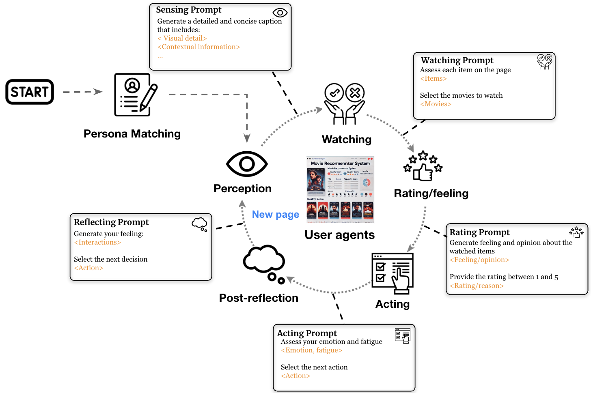

# SimUSER: When Language Models Pretend to Be Believable Users in Recommender Systems

## 📖 Description
This repository is the implemetation of SimUSER from [SimUSER: When Language Models Pretend to Be Believable Users in Recommender Systems](). 
Recommender systems play a central role in numerous real-life applications, yet evaluating their performance remains a significant challenge due to the gap between offline metrics and online behaviors. 
We introduce SimUSER, an agent framework that serves as believable and cost-effective human proxies for the evaluation of recommender systems. 
Leveraging the inductive bias of foundation models, SimUSER emulates synthetic users by first identifying self-consistent personas from historical data, enriching user profiles with unique backgrounds and personalities. Then, central to this evaluation are users equipped with persona, memory, perception, and brain modules, engaging in interactions with the recommender system. Specifically, the memory module consists of an episodic memory to log interactions and preferences, and a knowledge-graph memory that captures relationships between users and items. The perception module enables visual-driven reasoning, while the brain module translates retrieved information into actionable plans. We demonstrate through ablation studies that the components of our agent architecture contribute to the believability of user behavior. Across a set of recommendation domains, SimUSER exhibits closer alignment with real-world humans than prior state-of-the-art, at both micro and macro levels. 

   
  <em>Figure 1: The SimUSER Framework Architecture.</em>

## ⚙️ Usage
To be added soon
